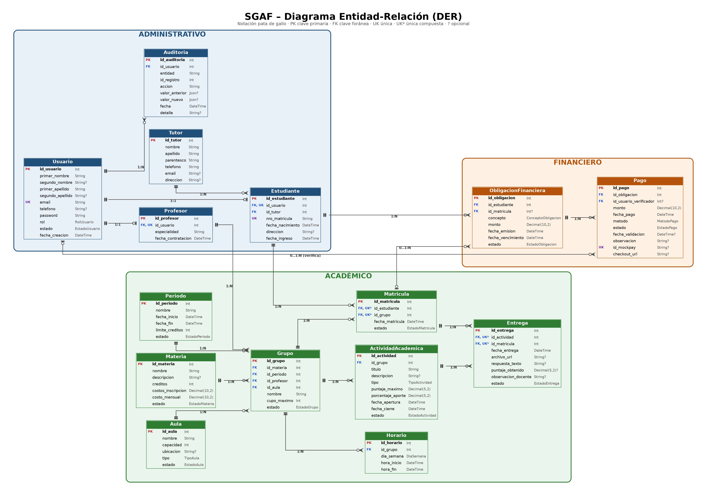

# SGAF — Sistema de Gestión Académica y Financiera

---

# Diagrama Entidad-Relación

El siguiente diagrama representa las entidades principales del Sistema de Gestión Académica y Financiera (SGAF), sus atributos, claves primarias, claves foráneas y relaciones.

---

# Entidades

## Entidad: Usuario

| Atributo           | Tipo          | Notas              |
| ------------------ | ------------- | ------------------ |
| `id_usuario`       | Número Entero | PK autoincremental |
| `primer_nombre`    | Texto         | Obligatorio        |
| `segundo_nombre`   | Texto         | Opcional           |
| `primer_apellido`  | Texto         | Obligatorio        |
| `segundo_apellido` | Texto         | Opcional           |
| `email`            | Texto         | Obligatorio, único |
| `telefono`         | Texto         | Opcional           |
| `password`         | Texto         | Obligatorio        |
| `rol`              | ENUM          | Obligatorio        |
| `estado`           | ENUM          | Obligatorio        |
| `fecha_creacion`   | Fecha/Hora    | Obligatorio        |

**Valores de `rol`:**

- `ADMIN`
- `RECEPCIONISTA`
- `PROFESOR`
- `ESTUDIANTE`

**Valores de `estado`:**

- `PENDIENTE`
- `ACTIVO`
- `SUSPENDIDO`
- `INACTIVO`

---

## Entidad: Estudiante

| Atributo           | Tipo          | Notas               |
| ------------------ | ------------- | ------------------- |
| `id_estudiante`    | Número Entero | PK autoincremental  |
| `id_usuario`       | Número Entero | FK → Usuario, único |
| `id_tutor`         | Número Entero | FK → Tutor          |
| `nro_matricula`    | Texto         | Obligatorio, único  |
| `fecha_nacimiento` | Fecha         | Obligatorio         |
| `direccion`        | Texto         | Opcional            |
| `fecha_ingreso`    | Fecha         | Obligatorio         |

---

## Entidad: Profesor

| Atributo             | Tipo          | Notas               |
| -------------------- | ------------- | ------------------- |
| `id_profesor`        | Número Entero | PK autoincremental  |
| `id_usuario`         | Número Entero | FK → Usuario, único |
| `especialidad`       | Texto         | Obligatorio         |
| `fecha_contratacion` | Fecha         | Obligatorio         |

---

## Entidad: Tutor

| Atributo     | Tipo          | Notas              |
| ------------ | ------------- | ------------------ |
| `id_tutor`   | Número Entero | PK autoincremental |
| `nombre`     | Texto         | Obligatorio        |
| `apellido`   | Texto         | Obligatorio        |
| `parentesco` | Texto         | Obligatorio        |
| `telefono`   | Texto         | Obligatorio        |
| `email`      | Texto         | Opcional           |
| `direccion`  | Texto         | Opcional           |

El tutor posee sus propios datos de contacto y puede estar asociado a uno o varios estudiantes.

---

## Entidad: Periodo

| Atributo          | Tipo          | Notas              |
| ----------------- | ------------- | ------------------ |
| `id_periodo`      | Número Entero | PK autoincremental |
| `nombre`          | Texto         | Obligatorio        |
| `fecha_inicio`    | Fecha         | Obligatorio        |
| `fecha_fin`       | Fecha         | Obligatorio        |
| `limite_creditos` | Número Entero | Obligatorio        |
| `estado`          | ENUM          | Obligatorio        |

**Valores de `estado`:**

- `PLANIFICADO`
- `ACTIVO`
- `FINALIZADO`

---

## Entidad: Materia

| Atributo            | Tipo          | Notas              |
| ------------------- | ------------- | ------------------ |
| `id_materia`        | Número Entero | PK autoincremental |
| `nombre`            | Texto         | Obligatorio        |
| `descripcion`       | Texto         | Opcional           |
| `creditos`          | Número Entero | Obligatorio        |
| `costo_inscripcion` | Decimal       | Obligatorio        |
| `costo_mensual`     | Decimal       | Obligatorio        |
| `estado`            | ENUM          | Obligatorio        |

**Valores de `estado`:**

- `ACTIVA`
- `INACTIVA`

Una materia puede ser ofrecida en diferentes grupos durante distintos períodos.

---

## Entidad: Aula

| Atributo    | Tipo          | Notas              |
| ----------- | ------------- | ------------------ |
| `id_aula`   | Número Entero | PK autoincremental |
| `nombre`    | Texto         | Obligatorio        |
| `capacidad` | Número Entero | Obligatorio        |
| `ubicacion` | Texto         | Opcional           |
| `tipo`      | ENUM          | Obligatorio        |
| `estado`    | ENUM          | Obligatorio        |

**Valores de `tipo`:**

- `FISICA`
- `VIRTUAL`

**Valores de `estado`:**

- `DISPONIBLE`
- `NO_DISPONIBLE`

---

## Entidad: Grupo

| Atributo      | Tipo          | Notas              |
| ------------- | ------------- | ------------------ |
| `id_grupo`    | Número Entero | PK autoincremental |
| `id_materia`  | Número Entero | FK → Materia       |
| `id_periodo`  | Número Entero | FK → Periodo       |
| `id_profesor` | Número Entero | FK → Profesor      |
| `id_aula`     | Número Entero | FK → Aula          |
| `nombre`      | Texto         | Obligatorio        |
| `cupo_maximo` | Número Entero | Obligatorio        |
| `estado`      | ENUM          | Obligatorio        |

**Valores de `estado`:**

- `ABIERTO`
- `CERRADO`
- `FINALIZADO`

Un grupo representa una instancia de una materia dentro de un período, con un profesor, un aula y un cupo determinado.

---

## Entidad: Horario

| Atributo      | Tipo          | Notas              |
| ------------- | ------------- | ------------------ |
| `id_horario`  | Número Entero | PK autoincremental |
| `id_grupo`    | Número Entero | FK → Grupo         |
| `dia_semana`  | ENUM          | Obligatorio        |
| `hora_inicio` | Hora          | Obligatorio        |
| `hora_fin`    | Hora          | Obligatorio        |

**Valores de `dia_semana`:**

- `LUNES`
- `MARTES`
- `MIERCOLES`
- `JUEVES`
- `VIERNES`
- `SABADO`
- `DOMINGO`

Un grupo puede tener uno o varios bloques horarios.

---

## Entidad: Matrícula

| Atributo          | Tipo          | Notas              |
| ----------------- | ------------- | ------------------ |
| `id_matricula`    | Número Entero | PK autoincremental |
| `id_estudiante`   | Número Entero | FK → Estudiante    |
| `id_grupo`        | Número Entero | FK → Grupo         |
| `fecha_matricula` | Fecha/Hora    | Obligatorio        |
| `estado`          | ENUM          | Obligatorio        |

**Valores de `estado`:**

- `PENDIENTE`
- `ACTIVA`
- `CANCELADA`
- `FINALIZADA`

**Restricción:**

La combinación `id_estudiante + id_grupo` debe ser única.

Además, el sistema controla que:

- el grupo tenga cupos disponibles;
- el período esté activo;
- la materia esté activa;
- el estudiante no supere el límite de créditos;
- el estudiante no se matricule dos veces en la misma materia dentro del mismo período;
- no existan traslapes de horarios;
- el estudiante no tenga obligaciones financieras vencidas.

---

## Entidad: Actividad Académica

| Atributo            | Tipo          | Notas              |
| ------------------- | ------------- | ------------------ |
| `id_actividad`      | Número Entero | PK autoincremental |
| `id_grupo`          | Número Entero | FK → Grupo         |
| `titulo`            | Texto         | Obligatorio        |
| `descripcion`       | Texto         | Opcional           |
| `tipo`              | ENUM          | Obligatorio        |
| `puntaje_maximo`    | Decimal       | Obligatorio        |
| `porcentaje_aporte` | Decimal       | Obligatorio        |
| `fecha_apertura`    | Fecha/Hora    | Obligatorio        |
| `fecha_cierre`      | Fecha/Hora    | Obligatorio        |
| `estado`            | ENUM          | Obligatorio        |

**Valores de `tipo`:**

- `TAREA`
- `PARCIAL`
- `PROYECTO`
- `EXAMEN`

**Valores de `estado`:**

- `BORRADOR`
- `ABIERTA`
- `CERRADA`

**Regla:**

La suma de los porcentajes de aporte de las actividades de un grupo debe ser 100%.

---

## Entidad: Entrega

| Atributo              | Tipo          | Notas                    |
| --------------------- | ------------- | ------------------------ |
| `id_entrega`          | Número Entero | PK autoincremental       |
| `id_actividad`        | Número Entero | FK → Actividad Académica |
| `id_matricula`        | Número Entero | FK → Matrícula           |
| `fecha_entrega`       | Fecha/Hora    | Obligatorio              |
| `archivo_url`         | Texto         | Opcional                 |
| `respuesta_texto`     | Texto         | Opcional                 |
| `puntaje_obtenido`    | Decimal       | Opcional                 |
| `observacion_docente` | Texto         | Opcional                 |
| `estado`              | ENUM          | Obligatorio              |

**Valores de `estado`:**

- `ENTREGADA`
- `CALIFICADA`

**Restricción:**

Un estudiante puede tener una única entrega por actividad.

La combinación `id_actividad + id_matricula` debe ser única.

---

## Entidad: Obligación Financiera

| Atributo            | Tipo          | Notas                    |
| ------------------- | ------------- | ------------------------ |
| `id_obligacion`     | Número Entero | PK autoincremental       |
| `id_estudiante`     | Número Entero | FK → Estudiante          |
| `id_matricula`      | Número Entero | FK → Matrícula, opcional |
| `concepto`          | ENUM          | Obligatorio              |
| `monto`             | Decimal       | Obligatorio              |
| `fecha_emision`     | Fecha         | Obligatorio              |
| `fecha_vencimiento` | Fecha         | Obligatorio              |
| `estado`            | ENUM          | Obligatorio              |

**Valores de `concepto`:**

- `INSCRIPCION`
- `MENSUALIDAD`
- `OTRO`

**Valores de `estado`:**

- `PENDIENTE`
- `PAGADA`
- `VENCIDA`
- `CANCELADA`

**Consideraciones:**

- `id_estudiante` permite asociar obligaciones generales al estudiante.
- `id_matricula` permite asociar una obligación con una matrícula concreta.
- Si `id_matricula` está informado, la matrícula debe pertenecer al mismo estudiante.
- Una obligación financiera puede tener cero o varios pagos.

---

## Entidad: Pago

| Atributo                 | Tipo          | Notas                      |
| ------------------------ | ------------- | -------------------------- |
| `id_pago`                | Número Entero | PK autoincremental         |
| `id_obligacion`          | Número Entero | FK → Obligación Financiera |
| `id_usuario_verificador` | Número Entero | FK → Usuario, opcional     |
| `monto`                  | Decimal       | Obligatorio                |
| `fecha_pago`             | Fecha/Hora    | Obligatorio                |
| `metodo`                 | ENUM          | Obligatorio                |
| `estado`                 | ENUM          | Obligatorio                |
| `fecha_validacion`       | Fecha/Hora    | Opcional                   |
| `observacion`            | Texto         | Opcional                   |
| `id_mockpay`             | Texto         | Opcional, único            |
| `checkout_url`           | Texto         | Opcional                   |

**Valores de `metodo`:**

- `EFECTIVO`
- `TRANSFERENCIA`
- `PASARELA`

**Valores de `estado`:**

- `PENDIENTE`
- `APROBADO`
- `RECHAZADO`

### Integración con MockPay

Cuando el método es `PASARELA`, el sistema:

1. Registra el pago localmente en estado `PENDIENTE`.
2. Envía una intención de pago a MockPay.
3. Guarda el identificador de transacción en `id_mockpay`.
4. Guarda la URL de checkout en `checkout_url`.
5. El estudiante realiza el pago en MockPay.
6. MockPay notifica el resultado mediante un webhook.
7. El webhook actualiza el pago a `APROBADO` o `RECHAZADO`.

Para pagos manuales mediante `EFECTIVO` o `TRANSFERENCIA`, el pago puede ser validado por un usuario autorizado de Recepción.

`id_usuario_verificador` identifica al usuario que realizó la validación manual.

---

## Entidad: Auditoría

| Atributo         | Tipo          | Notas              |
| ---------------- | ------------- | ------------------ |
| `id_auditoria`   | Número Entero | PK autoincremental |
| `id_usuario`     | Número Entero | FK → Usuario       |
| `entidad`        | Texto         | Obligatorio        |
| `id_registro`    | Número Entero | Obligatorio        |
| `accion`         | Texto         | Obligatorio        |
| `valor_anterior` | JSON          | Opcional           |
| `valor_nuevo`    | JSON          | Opcional           |
| `fecha`          | Fecha/Hora    | Obligatorio        |
| `detalle`        | Texto         | Opcional           |

La auditoría permite registrar acciones relevantes realizadas sobre los datos del sistema.

---

# Relaciones

| #   | Entidad origen        | Entidad destino       | Cardinalidad | Descripción                                                                     |
| --- | --------------------- | --------------------- | ------------ | ------------------------------------------------------------------------------- |
| 1   | Usuario               | Estudiante            | 1 : 0..1     | Un usuario puede estar asociado a cero o un estudiante.                         |
| 2   | Usuario               | Profesor              | 1 : 0..1     | Un usuario puede estar asociado a cero o un profesor.                           |
| 3   | Tutor                 | Estudiante            | 1 : N        | Un tutor puede tener muchos estudiantes; cada estudiante tiene un tutor.        |
| 4   | Materia               | Grupo                 | 1 : N        | Una materia puede tener muchos grupos; cada grupo pertenece a una materia.      |
| 5   | Periodo               | Grupo                 | 1 : N        | Un período puede tener muchos grupos; cada grupo pertenece a un período.        |
| 6   | Profesor              | Grupo                 | 1 : N        | Un profesor puede estar asignado a muchos grupos; cada grupo tiene un profesor. |
| 7   | Aula                  | Grupo                 | 1 : N        | Un aula puede ser utilizada por muchos grupos; cada grupo tiene un aula.        |
| 8   | Grupo                 | Horario               | 1 : N        | Un grupo puede tener muchos horarios.                                           |
| 9   | Estudiante            | Grupo                 | N : M        | Se resuelve mediante la entidad Matrícula.                                      |
| 10  | Grupo                 | Actividad Académica   | 1 : N        | Un grupo puede tener muchas actividades académicas.                             |
| 11  | Actividad Académica   | Entrega               | 1 : N        | Una actividad puede tener cero o muchas entregas.                               |
| 12  | Matrícula             | Entrega               | 1 : N        | Una matrícula puede tener muchas entregas.                                      |
| 13  | Estudiante            | Obligación Financiera | 1 : N        | Un estudiante puede tener muchas obligaciones financieras.                      |
| 14  | Obligación Financiera | Pago                  | 1 : N        | Una obligación puede tener cero o varios pagos.                                 |
| 15  | Usuario               | Pago                  | 1 : N        | Un usuario puede verificar muchos pagos.                                        |
| 16  | Usuario               | Auditoría             | 1 : N        | Un usuario puede generar muchos registros de auditoría.                         |

---

# Normalización

## Primera Forma Normal — 1FN

El modelo cumple con la primera forma normal porque cada atributo contiene valores atómicos y no se almacenan listas de valores dentro de una misma columna.

Por ejemplo:

- los nombres se almacenan en atributos individuales;
- los horarios se almacenan como registros independientes;
- las materias, grupos y actividades se representan mediante entidades separadas.

---

## Segunda Forma Normal — 2FN

El modelo cumple con la segunda forma normal porque los atributos no clave dependen completamente de la clave primaria de su entidad.

Se utilizan claves primarias simples y restricciones únicas para evitar duplicados en relaciones importantes.

Ejemplos:

- `id_estudiante + id_grupo` en Matrícula;
- `id_actividad + id_matricula` en Entrega.

---

## Tercera Forma Normal — 3FN

El modelo cumple con la tercera forma normal porque los atributos no clave dependen directamente de la clave primaria y se evita almacenar información que pertenece a otra entidad.

Por ejemplo:

- los datos personales se almacenan en Usuario;
- Estudiante y Profesor almacenan únicamente información específica de cada perfil;
- los datos de una Materia no se repiten en Grupo;
- la información del Profesor no se repite en Grupo;
- la información de la Obligación Financiera no se repite en Pago.

Las relaciones se representan mediante claves foráneas.

---

# Reglas principales de negocio

## Usuarios

- Existen cuatro roles: `ADMIN`, `RECEPCIONISTA`, `PROFESOR` y `ESTUDIANTE`.
- Los estudiantes pueden registrarse como postulantes.
- Los usuarios administrativos, recepcionistas y profesores son creados por un administrador.
- Un usuario pendiente no puede iniciar sesión.
- Recepción puede aprobar un postulante una vez verificado su pago de matrícula.
- Los usuarios pueden quedar suspendidos por obligaciones financieras vencidas.

## Matrículas

El sistema impide una matrícula cuando:

- el grupo no está abierto;
- el período no está activo;
- la materia no está activa;
- el grupo alcanzó su cupo máximo;
- el estudiante ya está matriculado en el grupo;
- el estudiante ya está matriculado en otra sección de la misma materia durante el período;
- se supera el límite de créditos;
- existe un traslape de horarios;
- el estudiante posee una obligación financiera vencida.

## Actividades y entregas

- Los docentes pueden crear actividades para sus grupos.
- Las actividades tienen fecha de apertura y cierre.
- Los estudiantes pueden realizar entregas correspondientes a sus matrículas.
- Una matrícula no puede tener más de una entrega para una misma actividad.
- Los docentes pueden registrar la calificación obtenida.

## Pagos

- Los pagos pueden realizarse mediante efectivo, transferencia o pasarela.
- Los pagos comienzan en estado `PENDIENTE`.
- Los pagos manuales pueden ser aprobados o rechazados por Recepción.
- Los pagos realizados mediante MockPay se actualizan mediante webhook.
- Un pago aprobado puede provocar que una obligación pase a estado `PAGADA`.
- Las transacciones de MockPay se identifican mediante `id_mockpay`.

---

# Tecnologías

- NestJS
- TypeScript
- Prisma ORM
- PostgreSQL
- Passport / JWT
- Swagger / OpenAPI
- class-validator
- MockPay
- Render
- Supabase

---

# Entregables

El proyecto incluye:

- API REST desarrollada con NestJS.
- Base de datos relacional PostgreSQL.
- Modelo de datos normalizado.
- DER con las entidades y relaciones.
- Autenticación mediante JWT.
- Autorización basada en roles.
- Validación de DTOs.
- Manejo de errores HTTP.
- Documentación mediante Swagger.
- Seed de datos para pruebas.
- Migraciones de Prisma.
- Integración con MockPay.
- Despliegue de la API en Render.
- Base de datos PostgreSQL gestionada mediante Supabase.
